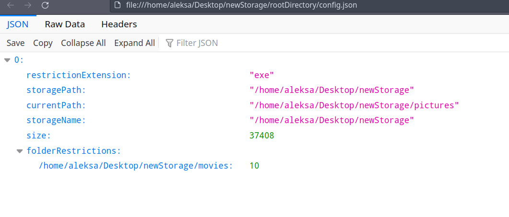
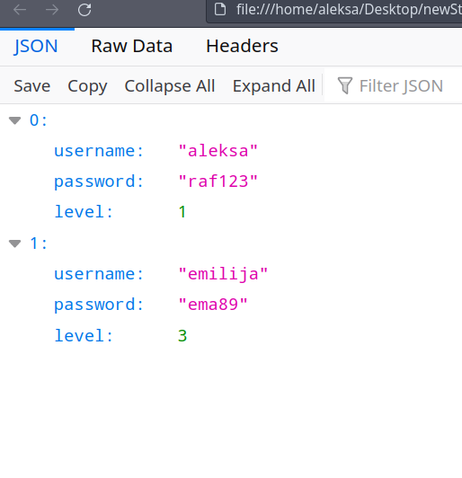

# FileStorage

## About The Project
[Project specification](https://github.com/Djokic00/FileStorage/blob/master/prvi_projekat.pdf) - Project Specification is written in Serbian language.

The project contains 4 separate applications: Specification, LocalImplementation, GoogleImplementation and CommandLine.

- Specification represents an API for working with files
- LocalImplementation is implementation of API for working with files on local machine
- GoogleImplementation is implementation of API for working with files on google drive
- CommandLine application is used to test different libraries (Local and Google)

File storage is a folder which contains two files - config.json and user.json. Former file contains information about size of the storage and restrictions in the storage and latter acts like database for the storage. Program is implemented to work with local machine or Google drive depending on how it was packaged (built). Additionally, to use google drive you have to change token for accessing drive and to uncomment Class.forName("GoogleImplementation") in CommandLine. 

## Usage

Program is used through command line interface. First step is to create a storage using ns command and absolute path which will be the location of the storage. After that, storage size, restriction, username and password, for the root user, will be required. Once the storage is created, all of the down commands are available for use.

<b>Notation:</b>

- parentheses (required)
- square brackets [optional]

### Command line operations:

- <b>list</b> - list of all available operations
- <b>ns (path)</b> - creates a new storage (path is absolute path)
- <b>path (path to storage)</b> - absolute path to storage
- <b>mkdir (folderName) [number of folders]</b> - makes one or more new directories
- <b>mkdir -res (folderName) (restriction) [number of folders]</b> - makes one or more directories with limited number of folders/files in it
- <b>touch (fileName)</b> - makes new file
- <b>cd (fileName)</b> - change current directory to fileName
- <b>cd..</b> - goes one step back from current directory
- <b>pwd</b> - print the name of the current working directory
- <b>rm (fileName)</b> - removes file or directory
- <b>logout</b> - disconnect the user (to connect again type path <path to storage>)
- <b>sort (asc or desc) [date or size]</b> - sort files in current directory, if optional argument is empty it sort files alphabetically
- <b>ls [filter]</b> - list files in current directory ( filter can be .txt or .jpeg or anything after dot (.) )
- <b>upload (fileName)</b> - uploads selected file from local system to a storage where user is logged-in
- <b>copy (fileName) (path) [files]</b> - copies one or more files to the new path
- <b>download (fileName)</b> - downloads selected file to "users.home" path.
- <b>move (fileName) (path) [files]</b> - moves one or more files to the given path 
- <b>exit</b> - exits from application
  
 | Config | Users |
 | ----- | ------ |
|  | |

## Technology stack

Technologies used in the project:
- Java 17
- Maven

## Code Contributors
 

